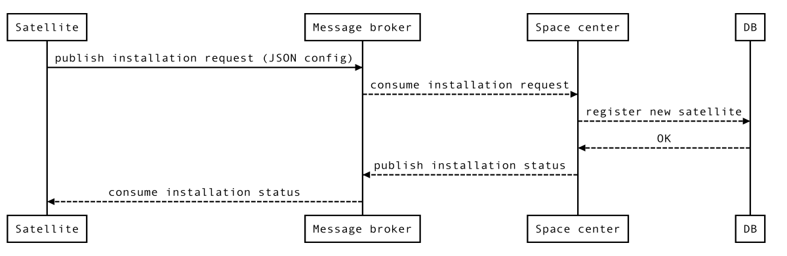
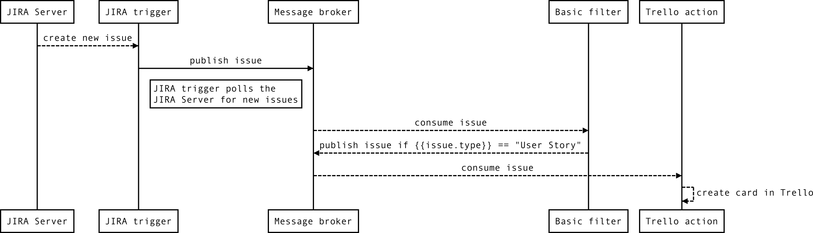

# Bird's-eye view
_Space center_ manages _satellites_. Satellite does one thing and does it well.
A satellite is a Go application that communicates with the space center via a _message broker_.
Satellite is either a _trigger_, a _filter_, a _modifier_, an _action_, or a _splitter_.
You can maximize throughput by running multiple instances of the same satellite on multiple hosts.

```
              ++++++++++++++
             |    host1     |
             |              |
             | Space center |
             |              |
              ++++++++++++++
                     ▲
                     |
                     ▼
         |---►Message broker◄--|
         ▼                     ▼
 ++++++++++++++++      ++++++++++++++++
|     host2      |    |     host3      |
|                |    |                |
| Basic modifier |    | Basic modifier |
| Basic splitter |    | Basic splitter |
| Basic filter   |    | Basic filter   |
| Redis filter   |    | Redis action   |
| Tail trigger   |    | File action    |
| Cron trigger   |    | Cron trigger   |
| JIRA trigger   |    | JIRA modifier  |
| Mail action    |    | Mail action    |
 ++++++++++++++++      ++++++++++++++++
 ````

# Message brokers
Planned support for NSQ, Kafka, Redis, RabbitMQ, SQS

# Example satellites
 - **Triggers**
   - Tail trigger (`tail -f somefile`)
   - HTTP callback trigger
   - Cron trigger
   - JIRA trigger
   - POP3 trigger (receive emails)
   - Twitter trigger (react on a #hashtag)
   - and more
 - **Filters**
   - Basic filter (`field == val`, `number >= value`, etc.)
   - PostgreSQL filter (`SELECT`)
   - Redis filter (`GET`, `HEXISTS`, `HGET`, etc.)
   - and more
 - **Modifiers**
   - Basic modifier (add/delete/change fields of a message)
   - PostgreSQL modifier (add/delete/change fields of a message based on a `SELECT`)
   - JIRA modifier (add/delete/change fields based on JIRA API query results)
   - and more
 - **Actions**
   - File action (append message to a file, create/update/delete file)
   - PostgreSQL action (`INSERT`, `UPDATE`, `DELETE`)
   - Mail action (send email)
   - Twitter action (post a tweet)
   - JIRA action (create/update/transition/etc. an issue)
   - and more
 - **Splitters**
   - Basic splitter (iterates over a collection and triggers each item as a message)

# Satellite

### Installation


### Pipeline
